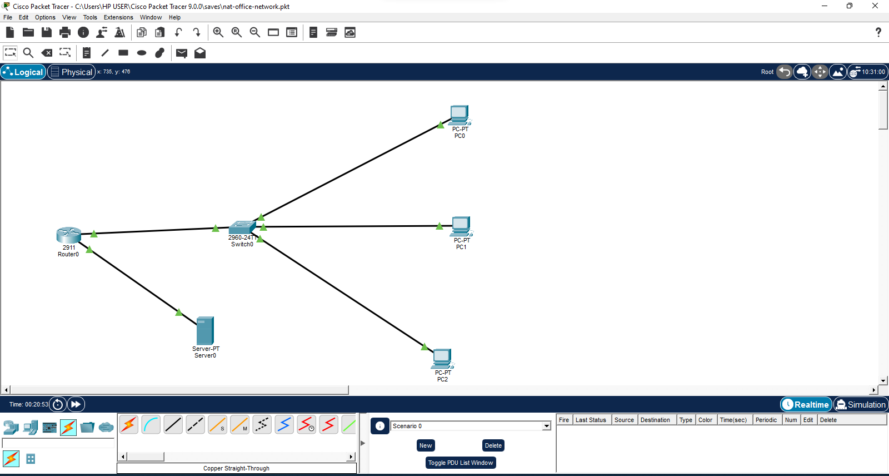
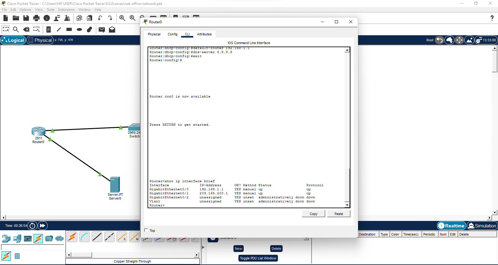
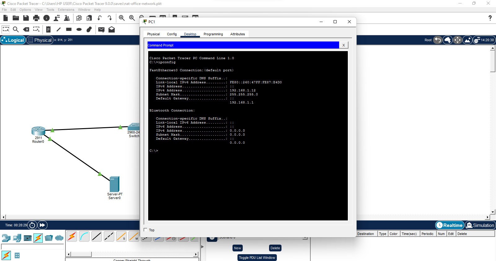
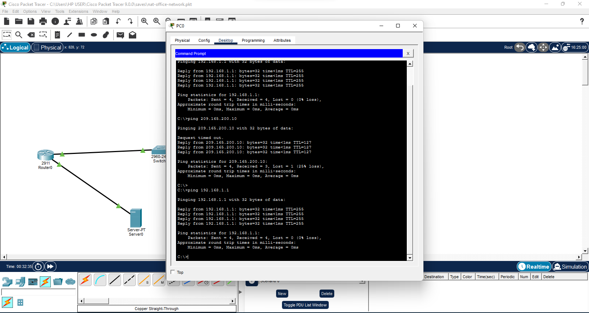
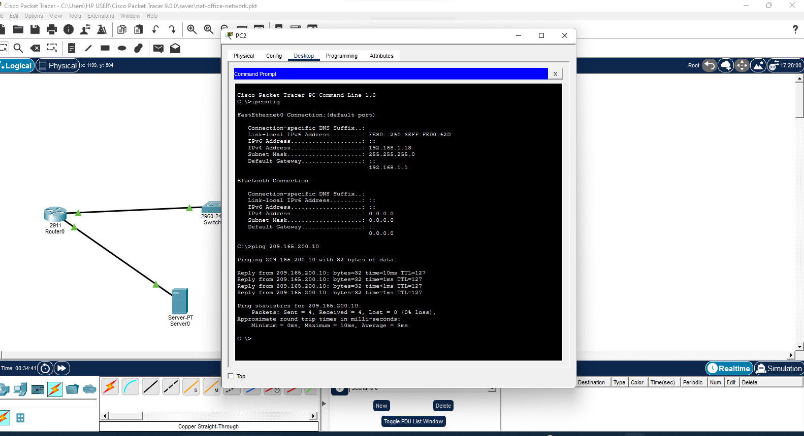

# 🖧 Enterprise Office Network Lab (NAT + DHCP)

Enterprise-style office network simulation built using Cisco Packet Tracer featuring router configuration, DHCP automation, WAN connectivity, NAT configuration, and network troubleshooting.

---

## 👨‍💻 Project Overview

This project simulates a real-world office network infrastructure environment using Cisco Packet Tracer.

The lab demonstrates practical ICT infrastructure, networking, routing, DHCP, NAT, and troubleshooting skills relevant to enterprise IT environments.

---

## 🎯 Objectives

- Configure a functional office LAN
- Implement router-based DHCP
- Configure WAN connectivity
- Implement NAT (Network Address Translation)
- Test device communication
- Troubleshoot connectivity issues
- Simulate enterprise network infrastructure

---

## 🖧 Network Topology

### Devices Used
- Cisco 2911 Router
- Cisco 2960 Switch
- Multiple PCs
- WAN/Server device

---

## 🌐 IP Addressing Scheme

### LAN Network
- Network: `192.168.1.0/24`
- Gateway: `192.168.1.1`

### WAN Network
- Network: `209.165.200.0/24`
- WAN Interface: `209.165.200.1`
- Server: `209.165.200.10`

---

## ⚙️ Router Configuration

### LAN Interface
```bash
interface gigabitEthernet 0/0
ip address 192.168.1.1 255.255.255.0
no shutdown
```

### WAN Interface
```bash
interface gigabitEthernet 0/1
ip address 209.165.200.1 255.255.255.0
no shutdown
```

---

## 📡 DHCP Configuration

```bash
ip dhcp excluded-address 192.168.1.1 192.168.1.10

ip dhcp pool OFFICE
network 192.168.1.0 255.255.255.0
default-router 192.168.1.1
dns-server 8.8.8.8
```

---

## 🔐 NAT Configuration

```bash
access-list 1 permit 192.168.1.0 0.0.0.255

ip nat inside source list 1 interface gigabitEthernet 0/1 overload
```

### NAT Interfaces

```bash
interface gigabitEthernet 0/0
ip nat inside

interface gigabitEthernet 0/1
ip nat outside
```

---

## 📡 Connectivity Testing

### Successful Tests
- PC to Router communication
- PC to WAN Server communication
- DHCP automatic IP assignment
- WAN interface connectivity
- LAN device communication

---

## 📸 Lab Evidence

### 🖧 Network Topology


---

### ⚙️ Router Interface Status


---

### 💻 DHCP IP Assignment


---

### 📡 Router Connectivity Test


---

### 🌍 WAN Connectivity Test


---

## 🛠 Tools & Technologies

- Cisco Packet Tracer
- TCP/IP Networking
- DHCP
- NAT
- Routing & Switching
- Network Troubleshooting
- CLI Configuration

---

## 🧠 Skills Demonstrated

- ICT Infrastructure Support
- Network Administration
- Router Configuration
- DHCP Deployment
- NAT Implementation
- Connectivity Troubleshooting
- WAN/LAN Networking
- Technical Diagnostics

---

## 📂 Included Files

- ``

- `README.md`
- Network screenshots and test evidence

---

## 🎯 Outcome

Successfully designed and configured a functional enterprise office network with:
- Automated IP assignment
- WAN communication
- NAT configuration
- Router-based infrastructure services
- End-to-end connectivity testing

This project demonstrates practical networking and ICT infrastructure skills aligned with enterprise IT support environments.

---

⭐ Continuously improving networking, infrastructure, and cybersecurity skills through practical labs and simulations.
